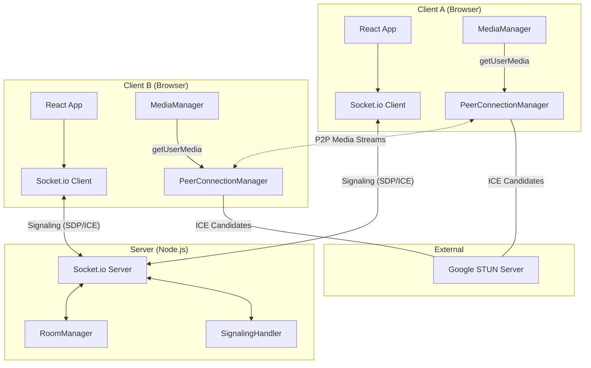
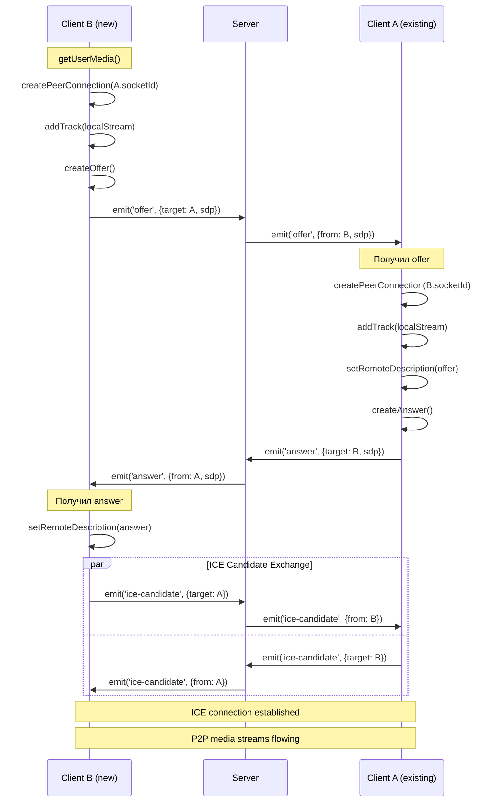

# Technical Design Document — Video Chat Room

| | |
|---|---|
| **Version** | 2.1 |
| **Date** | 2026-09-16 |
| **Status** | In Progress |
| **Feature** | video-chat-room |
| **Based on** | PRD: `prds/video-chat-room/prd-video-chat-room.md` v1.0 |

### История версий

| Версия | Дата | Изменения |
|--------|------|-----------|
| 1.0 | 2026-09-15 | Первоначальная версия: слоистая архитектура, Socket.io `join-room` с acknowledgement |
| 2.0 | 2026-09-16 | Переход на **MVC + сервисный слой**; добавлен REST API (Express) для управления комнатами; вход в комнату через `handshake.query` при WebSocket-подключении вместо события `join-room`; единый объект конфигурации; структура тестов зеркалит слои `src/` |
| 2.1 | 2026-09-16 | После code review: (1) `Room.tryAddParticipant()` — атомарная проверка лимита 4 участников; (2) WebRTC signaling: проверка `targetSocketId` в той же комнате перед relay (требование 6.4); (3) TTL-очистка пустых комнат (защита от утечки памяти); (4) `roomId` генерируется через `crypto.randomUUID()` (UUID v4); (5) интеграционный тест REST→WebSocket |

---

## 1. Overview / Контекст

### Цель фичи
Веб-приложение для группового видеозвонка с текстовым чатом, рассчитанное на **до 4 участников одновременно**. Пользователь открывает приложение, вводит отображаемое имя, создаёт комнату и делится ссылкой-приглашением; остальные присоединяются по этой ссылке. Внутри комнаты все видят и слышат друг друга в реальном времени и могут переписываться в общем чате.

### Ссылка на PRD
`prds/video-chat-room/prd-video-chat-room.md` — Product Requirements Document v1.0

### Проблема
Небольшим группам нужен мгновенный способ созвониться «лицом к лицу» прямо в браузере — без регистрации, установки приложений и сложной настройки.

### Решение
Лёгкое приложение «зашёл по ссылке — представился — общаешься»: видео + аудио через WebRTC, текстовый чат и системные события через Socket.io, без авторизации и без серверного хранения истории.

### Ключевые ограничения
- **Технический стек (зафиксирован):** JavaScript ES6+, Node.js, React, Socket.io, WebRTC
- **Топология:** WebRTC mesh (P2P между всеми участниками)
- **Лимит участников:** строго 4 (проверка атомарная на сервере)
- **Хранение:** in-memory (без БД, без персистентного хранилища)
- **NAT traversal:** только Google STUN (без TURN)
- **HTTPS обязателен:** getUserMedia требует защищенный контекст
- **Целевая платформа:** Chrome/Firefox/Edge 100+, desktop от 1024px
- **Язык интерфейса:** русский

---

## 2. Current Architecture & Codebase Summary

### Статус проекта
Backend реализован (MVC + сервисный слой). Документация:
- `prds/video-chat-room/prd-video-chat-room.md` — Product Requirements Document
- `prds/video-chat-room/design-video-chat-room.md` — этот TDD
- `prds/video-chat-room/impl-video-chat-room.md` — Implementation Plan
- `docs/prd-design.mdc` — правила генерации TDD
- `docs/prd-tasks.mdc` — правила генерации плана задач

### Просмотренные файлы
| Путь | Компонент | Назначение |
|------|-----------|-----------|
| — | — | Кодовая база отсутствует |

Архитектура и все компоненты будут созданы с нуля согласно данному TDD.

---

## 3. Proposed Architecture / High-Level Design

### Архитектурная диаграмма



### Топология WebRTC Mesh

```
4 участника = 6 P2P соединений всего (каждый с каждым)

Participant A: 3 исходящих потока (→ B, C, D)
Participant B: 3 исходящих потока (→ A, C, D)
Participant C: 3 исходящих потока (→ A, B, D)
Participant D: 3 исходящих потока (→ A, B, C)

Upload bandwidth на клиента: ~4.5 Mbps (при 720p, ~1.5 Mbps/поток)
```

### Компоненты системы

**Frontend (React):**
- UI компоненты для ввода имени, создания/входа в комнату
- Видеосетка (адаптивная раскладка 1–4 плитки)
- Панель управления (микрофон, камера, выход)
- Текстовый чат с историей
- WebRTC управление (RTCPeerConnection для каждого peer)
- Управление локальными медиа-устройствами

**Backend (Node.js + Socket.io):**
- HTTP-сервер (раздача статики)
- WebSocket-сервер (Socket.io)
- Управление комнатами в памяти
- Ретрансляция WebRTC сигналинга (SDP/ICE)
- Broadcast событий чата и системных уведомлений

**Infrastructure:**
- Google STUN для NAT traversal
- HTTPS (обязательно для getUserMedia)

---

## 4. Components & Interfaces

### Frontend Components

#### UI Components

**`StartScreen`**
- **Ответственность:** ввод отображаемого имени, создание/вход в комнату
- **Props:** `onJoinRoom: (roomId: string, userName: string) => void`
- **State:** `userName`, `roomIdInput`, `validation errors`

**`RoomScreen`**
- **Ответственность:** основной экран звонка, координация всех дочерних компонентов
- **Props:** `roomId: string`, `userName: string`
- **Children:** `VideoGrid`, `Controls`, `Chat`, `ParticipantList`

**`VideoGrid`**
- **Ответственность:** адаптивная сетка видео-плиток (1–4 участника)
- **Props:** `participants: Array`, `localStream: MediaStream`
- **Layout:** динамическая раскладка (1×1, 1×2, 2×2)

**`VideoTile`**
- **Ответственность:** отображение одного участника (видео + overlay)
- **Props:** `stream: MediaStream`, `userName: string`, `isMuted: boolean`, `isVideoOff: boolean`, `isLocal: boolean`
- **State:** показ аватара при отсутствии видео, индикатор muted mic

**`Controls`**
- **Ответственность:** управление микрофоном, камерой, выходом
- **Props:** `onToggleMic`, `onToggleVideo`, `onLeave`, `isMicEnabled`, `isVideoEnabled`

**`Chat`**
- **Ответственность:** панель текстового чата, отправка/прием сообщений
- **Props:** `messages: Array`, `onSendMessage: (text: string) => void`
- **State:** `inputText`, автопрокрутка к новым сообщениям

**`ParticipantList`**
- **Ответственность:** список участников комнаты
- **Props:** `participants: Array<{socketId, userName}>`

#### Core Modules

**`MediaManager`**
- **Ответственность:** управление локальными медиа-устройствами
- **API:**
  ```javascript
  class MediaManager {
    async getUserMedia(constraints)
    toggleAudio(enabled: boolean)
    toggleVideo(enabled: boolean)
    getLocalStream(): MediaStream
    stopTracks()
  }
  ```

**`PeerConnectionManager`**
- **Ответственность:** управление RTCPeerConnection для каждого peer
- **API:**
  ```javascript
  class PeerConnectionManager {
    createPeerConnection(socketId: string, isInitiator: boolean): RTCPeerConnection
    createOffer(socketId: string): Promise<RTCSessionDescriptionInit>
    handleOffer(socketId: string, sdp): Promise<RTCSessionDescriptionInit>
    handleAnswer(socketId: string, sdp)
    handleIceCandidate(socketId: string, candidate)
    closePeerConnection(socketId: string)
    closeAllConnections()
  }
  ```

### Backend Modules

**`server.js`**
- **Ответственность:** HTTP + Socket.io сервер, точка входа
- **Инициализация:** Express app, Socket.io server, статика, HTTPS сертификаты

**`RoomManager`**
- **Ответственность:** управление комнатами и участниками в памяти
- **API:**
  ```javascript
  class RoomManager {
    createRoom(roomId: string): Room
    joinRoom(roomId: string, socketId: string, userName: string): {success, participants, error}
    leaveRoom(socketId: string): {roomId, userName, shouldDeleteRoom}
    getRoom(roomId: string): Room | null
    getRoomParticipants(roomId: string): Array
    addChatMessage(roomId: string, message: Message): void
    getChatHistory(roomId: string): Array
  }
  ```

**`SignalingHandler`**
- **Ответственность:** обработка WebRTC сигналинга и Socket.io событий
- **События:** регистрация обработчиков для `join-room`, `leave-room`, `offer`, `answer`, `ice-candidate`, `chat-message`, `disconnecting`

### Socket.io Events

#### Client → Server

| Event | Payload | Response | Description |
|-------|---------|----------|-------------|
| `join-room` | `{roomId: string, userName: string}` | acknowledgement callback | Вход в комнату |
| `leave-room` | `{roomId: string}` | — | Выход из комнаты |
| `offer` | `{roomId: string, targetSocketId: string, sdp: RTCSessionDescriptionInit}` | — | WebRTC offer |
| `answer` | `{roomId: string, targetSocketId: string, sdp: RTCSessionDescriptionInit}` | — | WebRTC answer |
| `ice-candidate` | `{roomId: string, targetSocketId: string, candidate: RTCIceCandidateInit}` | — | ICE candidate |
| `chat-message` | `{roomId: string, message: string}` | — | Текстовое сообщение |

#### Server → Client (broadcast/emit)

| Event | Payload | Target | Description |
|-------|---------|--------|-------------|
| `user-joined` | `{socketId: string, userName: string}` | room | Участник вошел |
| `user-left` | `{socketId: string, userName: string}` | room | Участник вышел |
| `chat-message` | `{from: string, fromName: string, message: string, timestamp: number}` | room | Сообщение чата |
| `offer` | `{fromSocketId: string, sdp: RTCSessionDescriptionInit}` | individual | WebRTC offer |
| `answer` | `{fromSocketId: string, sdp: RTCSessionDescriptionInit}` | individual | WebRTC answer |
| `ice-candidate` | `{fromSocketId: string, candidate: RTCIceCandidateInit}` | individual | ICE candidate |
| `media-state-changed` | `{socketId: string, kind: 'video'\|'audio', enabled: boolean}` | room | Изменение состояния медиа |

---

## 5. Data Model & DB Changes

### In-Memory Data Structures

#### Room
```javascript
{
  roomId: string,              // UUID v4
  participants: Map<socketId, Participant>,
  chatHistory: Array<Message>,
  createdAt: Date
}
```

#### Participant
```javascript
{
  socketId: string,            // уникальный ID (socket.id)
  name: string,                // отображаемое имя (≤30 символов)
  roomId: string,
  joinedAt: Date,
  mediaState: {
    audio: boolean,            // микрофон включен
    video: boolean             // камера включена
  }
}
```

#### Message
```javascript
{
  from: string,                // socketId отправителя
  fromName: string,            // имя отправителя
  message: string,             // текст (1..1000 символов)
  timestamp: number,           // Date.now()
  type: 'user' | 'system'      // тип сообщения
}
```

### Data Storage

**Серверная память:**
- `rooms: Map<roomId, Room>` — все активные комнаты
- При выходе последнего участника комната и её история полностью удаляются

**Клиентская память:**
- Ничего не сохраняется между перезагрузками (без localStorage)
- Вся история сессии теряется при закрытии вкладки

### Database Migrations
Не требуются — персистентное хранилище отсутствует.

---

## 6. API / Contracts

### Архитектура: MVC + REST + WebSocket

Приложение использует паттерн **MVC** с сервисным слоем:
- **Models** (`Room`, `Participant`) — структуры данных
- **Services** (`RoomService`) — бизнес-логика, общая для HTTP и WebSocket
- **Controllers** (`RoomController` — REST, `SocketController` — WebSocket)

**Разделение HTTP и WebSocket:**
- **REST API** (Express) — управление комнатами до входа: создание, проверка существования, список участников
- **WebSocket** (Socket.io) — клиент подключается ТОЛЬКО при входе в комнату; параметры входа (`roomId`, `userName`) передаются в `handshake.query`. Real-time: чат, WebRTC-сигналинг, состояние медиа

---

### REST API (Express)

#### `POST /api/rooms` — создать комнату

**Request:**
```json
{ "userName": "Alice" }
```

**Response `201`:**
```json
{ "roomId": "3usl6d", "createdAt": 1789507694392 }
```

**Response `400`:** `{ "error": "userName is required" }`

#### `GET /api/rooms/:roomId` — информация о комнате

**Response `200`:**
```json
{ "exists": true, "participantCount": 2, "isFull": false }
```

**Response `404`:** `{ "error": "Room not found" }`

#### `GET /api/rooms/:roomId/participants` — список участников

**Response `200`:**
```json
{
  "participants": [
    { "socketId": "abc", "userName": "Alice", "mediaState": { "audio": true, "video": true } }
  ]
}
```

**Response `404`:** `{ "error": "Room not found" }`

#### `GET /health` — статус сервера

**Response `200`:** `{ "status": "ok", "timestamp": "2026-09-15T21:28:14.448Z" }`

---

### Socket.io Event Schemas

#### Подключение к комнате (handshake)

Клиент подключается к Socket.io с параметрами входа в query. Сервер валидирует их в `handleConnection`, добавляет участника (атомарная проверка лимита 4) и присоединяет к комнате.

```javascript
const socket = io('https://localhost:3000', {
  query: { roomId: '<uuid v4>', userName: 'Alice' }
})
```

**Server → Client `room-joined`** (успешный вход):
```javascript
{
  participants: [   // существующие участники (без себя)
    { socketId: string, userName: string, mediaState: { audio: boolean, video: boolean } }
  ],
  chatHistory: [
    { id, from, fromName, message, timestamp, type: 'user' | 'system', text? }
  ]
}
```

**Server → Client `error`** (отказ, после чего сокет отключается):
```javascript
{ type: 'validation' | 'room-full', message: string }
```

**Server → Room `user-joined`** (новый участник):
```javascript
{ socketId: string, userName: string, mediaState: { audio: boolean, video: boolean } }
```

**Server → Room `user-left`** (участник вышел / отключился):
```javascript
{ socketId: string, userName: string }
```

**Server → Room `system-message`** (вход/выход):
```javascript
{ id: string, type: 'system', text: string, timestamp: number }
```

#### `chat-message`

**Client → Server:**
```javascript
socket.emit('chat-message', { message: string })  // roomId известен из сессии
```

**Server → Room (broadcast, включая отправителя):**
```javascript
{ from: string, fromName: string, message: string, timestamp: number }
```

Rate limiting: 5 сообщений/сек на socketId; при превышении отправителю приходит `error { type: 'rate-limit' }`.

#### `media-state`

**Client → Server:**
```javascript
socket.emit('media-state', { audio: boolean, video: boolean })
```

**Server → Room `media-state-changed`:**
```javascript
{ socketId: string, mediaState: { audio: boolean, video: boolean } }
```

#### WebRTC signaling: `offer` / `answer` / `ice-candidate`

**Client → Server:**
```javascript
socket.emit('offer', { targetSocketId: string, sdp: RTCSessionDescriptionInit })
socket.emit('answer', { targetSocketId: string, sdp: RTCSessionDescriptionInit })
socket.emit('ice-candidate', { targetSocketId: string, candidate: RTCIceCandidateInit })
```

**Server → Target (unicast):**
```javascript
{ from: string, sdp }          // для offer/answer
{ from: string, candidate }    // для ice-candidate
```

### Validation Rules

#### `userName`
```javascript
const USER_NAME_REGEX = /^[\p{L}\p{N} _-]{1,30}$/u;

function validateUserName(name) {
  const trimmed = name.trim();
  if (!trimmed || trimmed.length > 30) return false;
  return USER_NAME_REGEX.test(trimmed);
}
```

#### `roomId`
```javascript
const UUID_V4_REGEX = /^[0-9a-f]{8}-[0-9a-f]{4}-4[0-9a-f]{3}-[89ab][0-9a-f]{3}-[0-9a-f]{12}$/i;

function validateRoomId(roomId) {
  return UUID_V4_REGEX.test(roomId);
}
```

#### `message`
```javascript
function validateMessage(message) {
  const trimmed = message.trim();
  if (!trimmed || trimmed.length === 0) return false;
  if (trimmed.length > 1000) return false;
  return true;
}
```

---

## 7. Data & Control Flows

### Создание комнаты

```
1. Пользователь вводит имя на StartScreen
2. Клик "Создать комнату"
3. Frontend генерирует roomId (UUID v4)
4. Navigate к `/room/:roomId`
5. Автоматический вход в комнату (см. "Вход в комнату")
```

### Вход в комнату

```
1. Клиент открывает `/room/:roomId`
2. Если имя не введено → запрос имени
3. getUserMedia() → получение локального stream
4. socket.emit('join-room', {roomId, userName}, callback)
5. Сервер:
   - Валидация userName и roomId
   - Проверка лимита (participants.size < 4)
   - Добавление участника в комнату
   - Broadcast 'user-joined' остальным
   - Callback с participants и chatHistory
6. Клиент:
   - Отображение локального видео
   - Для каждого existing participant:
     * Создание RTCPeerConnection
     * Создание offer (см. "WebRTC Handshake")
```

### WebRTC Handshake (новый участник B входит к существующему A)



**Правило против glare:**
- Offer создаёт ТОЛЬКО новый участник (B)
- Существующие участники (A) только отвечают (answer)
- Это исключает simultaneous offer (glare situation)

### Отправка сообщения в чат

```
1. Участник вводит текст в Chat компонент
2. Нажатие Enter или кнопки "Отправить"
3. Валидация на клиенте (не пустое, ≤1000 символов)
4. socket.emit('chat-message', {roomId, message})
5. Сервер:
   - Валидация и sanitization (XSS защита)
   - Добавление в chatHistory комнаты
   - socket.to(roomId).emit('chat-message', {from, fromName, message, timestamp})
6. Все клиенты получают сообщение и добавляют в UI
7. Автопрокрутка чата к последнему сообщению
```

### Переключение микрофона/камеры

```
1. Клик на кнопку микрофона/камеры в Controls
2. MediaManager.toggleAudio(enabled) или toggleVideo(enabled)
3. Для audio: track.enabled = !track.enabled
4. Для video:
   - Выключение: stopTrack(), освобождение устройства
   - Включение: getUserMedia({video: true}), замена track
5. socket.emit('media-state-changed', {roomId, kind, enabled})
6. Сервер broadcast всем: media-state-changed
7. Остальные обновляют UI:
   - audio off → иконка перечёркнутого микрофона
   - video off → показать аватар/заглушку
```

### Выход участника

```
1. Клик "Выйти" или закрытие вкладки
2. socket.on('disconnecting') event на сервере
   - Важно: использовать 'disconnecting', а не 'disconnect'
   - В 'disconnect' сокет уже покинул комнаты, roomId недоступен
3. roomManager.leaveRoom(socket.id)
4. Если последний участник:
   - Удалить комнату и всю историю
5. Иначе:
   - socket.to(roomId).emit('user-left', {socketId, userName})
6. Остальные клиенты:
   - Закрывают RTCPeerConnection с ушедшим
   - Удаляют его VideoTile
   - Добавляют системное сообщение в чат
```

---

## 8. Error Handling & Edge Cases

### Комната заполнена (5-й участник)

**Обработка:**
- Сервер: атомарная проверка `participants.size < 4` перед добавлением
- Response: `{success: false, error: 'room-full'}`
- Клиент: показать экран "Комната заполнена (4/4)" с кнопкой "Повторить попытку"

### Отказ в доступе к медиа-устройствам

**Scenario:** пользователь отклонил запрос getUserMedia

**Обработка:**
```javascript
try {
  const stream = await navigator.mediaDevices.getUserMedia({video: true, audio: true});
} catch (error) {
  if (error.name === 'NotAllowedError' || error.name === 'PermissionDeniedError') {
    // Показать сообщение: "Доступ к камере/микрофону запрещён"
    // Пользователь остаётся в комнате без медиа
    // mediaState: {audio: false, video: false}
  }
}
```

**UI:** участник без медиа отображается с аватаром/силуэтом и именем.

### ICE Connection States

**`iceConnectionState === 'failed'`:**
```javascript
peerConnection.on('iceconnectionstatechange', () => {
  if (peerConnection.iceConnectionState === 'failed') {
    // Показать: "Соединение потеряно с [userName]"
    // Предложить: "Перезайти в комнату"
  }
})
```

**`iceConnectionState === 'disconnected'`:**
```javascript
// Показать индикатор "Переподключение..."
// Ждать 5 секунд
setTimeout(() => {
  if (peerConnection.iceConnectionState === 'connected') {
    // Скрыть индикатор
  } else {
    // Считать соединение потерянным
  }
}, 5000)
```

### MediaStreamTrack.onended

**Scenario:** пользователь физически отключил камеру/микрофон или отозвал разрешение

```javascript
track.onended = () => {
  // Устройство потеряно
  // Выключить соответствующий контрол в UI
  mediaManager.toggleVideo(false) // или toggleAudio(false)
  
  // Разослать обновление
  socket.emit('media-state-changed', {roomId, kind: track.kind, enabled: false})
}
```

### Socket.io Connection Issues

**Недоступность сервера:**
```javascript
socket.on('connect_error', (error) => {
  // Показать: "Не удалось подключиться к серверу"
  // Retry logic: 3 попытки с задержкой 2s
})
```

**Socket.io heartbeat configuration:**
```javascript
// server.js
const io = new Server(server, {
  pingTimeout: 20000,    // 20 секунд без pong → disconnect
  pingInterval: 25000    // каждые 25 сек ping
})
```

**Назначение:** предотвратить «мёртвые» комнаты, когда клиент потерял соединение, но сервер ещё не знает об этом.

### Событие `disconnecting` vs `disconnect`

**Правильно:**
```javascript
socket.on('disconnecting', (reason) => {
  // socket.rooms ещё доступны
  const rooms = Array.from(socket.rooms);
  rooms.forEach(roomId => {
    if (roomId !== socket.id) {
      roomManager.leaveRoom(socket.id)
    }
  })
})
```

**Неправильно:**
```javascript
socket.on('disconnect', (reason) => {
  // socket.rooms уже пуст, roomId недоступен
})
```

### Браузер без поддержки WebRTC

**Проверка при загрузке:**
```javascript
if (!window.RTCPeerConnection) {
  // Показать: "Ваш браузер не поддерживает WebRTC"
  // Рекомендация: "Используйте Chrome, Firefox или Edge"
}
```

### Autoplay Policy

**Scenario:** браузер блокирует автозапуск удалённого аудио

**Решение:**
```javascript
// После получения remote stream
remoteAudio.play().catch(error => {
  if (error.name === 'NotAllowedError') {
    // Показать кнопку "Включить звук"
    // После клика пользователя:
    remoteAudio.play()
  }
})
```

**Альтернатива:** жест входа в комнату (клик "Войти") уже считается user interaction.

### Потеря устройства во время звонка

**Scenario:** камера/микрофон стали недоступны (заняты другим приложением, отключены физически)

**Обработка:** см. MediaStreamTrack.onended выше.

**Восстановление:** пользователь должен вручную выбрать устройство через настройки браузера/ОС, затем повторно включить в Controls.

---

## 9. Performance & Scalability

### Целевые метрики

| Метрика | Целевое значение | Контекст |
|---------|------------------|----------|
| Медиа-задержка (latency) | ≤500ms | Локальная сеть |
| RTT сигналинга | ≤100ms | Socket.io ping |
| Время входа в комнату | ≤2s | От клика до отображения видео |
| Video resolution | 720p (1280×720) | По умолчанию |
| Video framerate | 30 fps | По умолчанию |

### Ограничения Mesh Топологии

**Bandwidth:**
- 4 участника = 3 исходящих потока на клиента
- При 720p @ 1.5 Mbps/поток: ~4.5 Mbps upload
- При 1080p @ 2.5 Mbps/поток: ~7.5 Mbps upload (не рекомендуется)

**CPU:**
- Кодирование 3 исходящих потоков (VP8/VP9/H.264)
- Декодирование 3 входящих потоков
- Может быть тяжело на слабых устройствах

**Scalability:**
- Mesh не масштабируется >4 участников
- Для 5+ участников требуется SFU архитектура (out of scope)

### Оптимизации

**Video constraints:**
```javascript
const constraints = {
  video: {
    width: { ideal: 1280 },
    height: { ideal: 720 },
    frameRate: { ideal: 30 }
  },
  audio: {
    echoCancellation: true,
    noiseSuppression: true,
    autoGainControl: true
  }
}
```

**React optimizations:**
```javascript
// VideoTile с React.memo
export const VideoTile = React.memo(({stream, userName, isMuted, isVideoOff}) => {
  // ...
}, (prevProps, nextProps) => {
  return prevProps.stream === nextProps.stream &&
         prevProps.isMuted === nextProps.isMuted &&
         prevProps.isVideoOff === nextProps.isVideoOff
})
```

**No explicit bitrate cap:**
- WebRTC автоматически адаптирует битрейт под bandwidth
- Явное ограничение не задаётся

---

## 10. Security & Compliance

### XSS Protection

**userName sanitization:**
```javascript
// Server-side
import DOMPurify from 'isomorphic-dompurify';

function sanitizeUserName(name) {
  return DOMPurify.sanitize(name.trim(), {ALLOWED_TAGS: []});
}
```

**Chat message sanitization:**
```javascript
// Client-side rendering
function renderMessage(message) {
  const div = document.createElement('div');
  div.textContent = message.message; // textContent автоматически экранирует
  return div.innerHTML;
}
```

**React:**
```jsx
<div>{message.message}</div> {/* React автоматически экранирует */}
```

### Validation Rules

**userName:**
- Regex: `/^[\p{L}\p{N} _-]{1,30}$/u`
- Trim, max 30 символов
- Буквы (любые Unicode), цифры, пробел, `_`, `-`

**message:**
- Trim, 1..1000 символов Unicode
- Не пустое после trim
- Санитизация на сервере

**roomId:**
- UUID v4 формат
- Сложно угадать (2^122 вариантов)

### Content Security Policy

**HTTP headers:**
```javascript
app.use((req, res, next) => {
  res.setHeader("Content-Security-Policy", 
    "default-src 'self'; " +
    "connect-src 'self' wss://your-domain.com; " +
    "media-src 'self' blob:; " +
    "script-src 'self'; " +
    "style-src 'self' 'unsafe-inline'"
  );
  next();
});
```

### Media Encryption

**DTLS-SRTP:**
- Встроено в WebRTC по умолчанию
- Все медиа-потоки шифруются автоматически
- E2E шифрование сверх этого — out of scope

### HTTPS

**Development:**
```bash
# mkcert для локальных сертификатов
mkcert -install
mkcert localhost 127.0.0.1 ::1
```

**Production:**
```bash
# Let's Encrypt с certbot
certbot certonly --standalone -d your-domain.com
```

**Node.js:**
```javascript
const https = require('https');
const fs = require('fs');

const server = https.createServer({
  key: fs.readFileSync('path/to/privkey.pem'),
  cert: fs.readFileSync('path/to/cert.pem')
}, app);
```

### Access Control

**Доступ к комнатам:**
- Намеренно не ограничивается (по дизайну PRD)
- Любой, кто знает roomId, может войти
- roomId сложно угадать (UUID v4)
- Для приватных комнат потребовалась бы авторизация (out of scope)

### Rate Limiting

**Chat flooding protection:**
```javascript
// Server-side: 10 сообщений/сек на участника
const messageRateLimiter = new Map(); // socketId → {count, resetAt}

socket.on('chat-message', ({roomId, message}) => {
  const now = Date.now();
  const limit = messageRateLimiter.get(socket.id);
  
  if (!limit || now > limit.resetAt) {
    messageRateLimiter.set(socket.id, {count: 1, resetAt: now + 1000});
  } else if (limit.count >= 10) {
    return; // Отклонить
  } else {
    limit.count++;
  }
  
  // Обработка сообщения
})
```

---

## 11. Testing Strategy

### Unit Tests (Backend)

**RoomManager:**
```javascript
describe('RoomManager', () => {
  test('создание комнаты при первом участнике')
  test('вход в существующую комнату')
  test('отклонение 5-го участника (лимит)')
  test('удаление комнаты при выходе последнего')
  test('добавление сообщения в chatHistory')
  test('валидация userName')
})
```

**Coverage target:** 80%

**Tools:** Jest, Node.js test runner

### Integration Tests (Socket.io)

**Scenarios:**
```javascript
describe('Socket.io Events', () => {
  test('создание комнаты и вход 4 участников')
  test('отклонение 5-го участника с ошибкой room-full')
  test('обмен сообщениями в чате между участниками')
  test('broadcast user-joined при входе')
  test('broadcast user-left при выходе')
  test('relay WebRTC signaling (offer/answer/ice)')
  test('выход последнего участника → удаление комнаты')
  test('disconnecting event обрабатывается корректно')
})
```

**Tools:** Jest + socket.io-client

### E2E Tests

**Scenarios:**
```javascript
describe('E2E User Flows', () => {
  test('создание комнаты, копирование ссылки')
  test('вход по ссылке-приглашению')
  test('отображение видео всех участников')
  test('отправка и получение сообщений в чате')
  test('включение/выключение микрофона')
  test('включение/выключение камеры')
  test('выход из комнаты')
  test('закрытие вкладки = выход')
  test('экран "Комната заполнена" при 5-м участнике')
})
```

**Tools:** Playwright или Puppeteer

**Environment:** headless Chrome с fake media devices

### WebRTC Testing

**Manual testing matrix:**

| Browser | Version | Video | Audio | ICE | Notes |
|---------|---------|-------|-------|-----|-------|
| Chrome | 100+ | ✓ | ✓ | ✓ | Baseline |
| Firefox | 100+ | ✓ | ✓ | ✓ | Check codec support |
| Edge | 100+ | ✓ | ✓ | ✓ | Chromium-based |

**NAT scenarios:**
- Same local network (direct P2P)
- Different networks (via STUN)
- Symmetric NAT (может не работать без TURN — приемлемо)

**Media devices:**
- С камерой и микрофоном
- Без камеры (только микрофон)
- Без микрофона (только камера)
- Без обоих (аватар + отключенный микрофон)

### Load Testing

**Out of scope** для MVP:
- Single-server архитектура
- In-memory хранилище
- Нет требований к concurrent rooms

---

## 12. Deployment & Migration Plan

### Project Structure

```
video-chat-room/
├── client/                    # React frontend
│   ├── public/
│   │   ├── index.html
│   │   └── favicon.ico
│   ├── src/
│   │   ├── components/
│   │   │   ├── StartScreen.jsx
│   │   │   ├── RoomScreen.jsx
│   │   │   ├── VideoGrid.jsx
│   │   │   ├── VideoTile.jsx
│   │   │   ├── Controls.jsx
│   │   │   ├── Chat.jsx
│   │   │   └── ParticipantList.jsx
│   │   ├── hooks/
│   │   │   ├── useMediaManager.js
│   │   │   ├── usePeerConnection.js
│   │   │   └── useSocket.js
│   │   ├── utils/
│   │   │   ├── MediaManager.js
│   │   │   ├── PeerConnectionManager.js
│   │   │   └── validation.js
│   │   ├── App.jsx
│   │   └── main.jsx
│   ├── package.json
│   └── vite.config.js
├── server/                    # Node.js backend (MVC + service layer)
│   ├── src/
│   │   ├── config/            # Configuration (reads from .env)
│   │   │   └── index.js       # single config object: port, ssl, logLevel, socketIO
│   │   ├── models/           # Data models (M in MVC)
│   │   │   ├── Room.js        # Room: participants, chat history, limits
│   │   │   └── Participant.js # Participant: socketId, userName, mediaState
│   │   ├── services/         # Business logic layer
│   │   │   └── RoomService.js # room lifecycle, participants, chat, media state
│   │   ├── controllers/      # Controllers (C in MVC)
│   │   │   ├── RoomController.js   # REST API handlers (HTTP)
│   │   │   └── SocketController.js # WebSocket handlers (real-time)
│   │   ├── routes/           # Express routing
│   │   │   └── api.js         # REST API routes (/api/rooms)
│   │   ├── validation/       # Validation & XSS protection
│   │   │   ├── constants.js
│   │   │   ├── messages.js    # localized error messages (ru)
│   │   │   ├── userName.js
│   │   │   ├── roomId.js
│   │   │   ├── message.js
│   │   │   └── index.js
│   │   ├── infrastructure/   # Infrastructure layer
│   │   │   ├── RateLimiter.js # chat rate limiting (5 msg/sec)
│   │   │   ├── logger.js      # winston logger
│   │   │   └── ssl.js         # SSL certificate loader
│   │   ├── setup/            # App composition root
│   │   │   └── app.js         # createApp(): wires MVC + Socket.io together
│   │   └── server.js         # Entry point: only listen() + graceful shutdown
│   ├── tests/                # Test structure mirrors src/ layers
│   │   ├── models/
│   │   │   ├── Room.js
│   │   │   └── Participant.js
│   │   ├── services/
│   │   │   └── RoomService.js
│   │   └── controllers/
│   │       ├── RoomController.js   # REST API integration tests
│   │       └── SocketController.js # WebSocket integration tests
│   ├── certs/                # mkcert SSL certificates (gitignored)
│   ├── vitest.config.js
│   ├── package.json
│   └── .env.example
├── prds/
│   └── video-chat-room/
│       ├── prd-video-chat-room.md   # PRD
│       ├── design-video-chat-room.md # TDD (this doc)
│       └── impl-video-chat-room.md   # Implementation Plan
├── docs/
│   ├── prd-design.mdc                # TDD generation rules
│   └── prd-tasks.mdc                 # Implementation Plan generation rules
├── .gitignore
└── README.md
```

### Environment Variables

**Server (`.env`):**
```bash
# Server configuration
PORT=3000
NODE_ENV=development

# HTTPS (development)
SSL_KEY_PATH=./certs/localhost-key.pem
SSL_CERT_PATH=./certs/localhost.pem

# Socket.io
PING_TIMEOUT=20000
PING_INTERVAL=25000

# Logging
LOG_LEVEL=info
```

**Client (`.env`):**
```bash
# API endpoint
VITE_API_URL=https://localhost:3000

# STUN server
VITE_STUN_SERVER=stun:stun.l.google.com:19302

# Environment
VITE_NODE_ENV=development
```

### Build & Deploy Steps

**Development:**
```bash
# 1. Install dependencies
cd client && npm install
cd ../server && npm install

# 2. Generate HTTPS certificates (mkcert)
mkcert -install
mkcert localhost 127.0.0.1 ::1
mv localhost+2.pem server/certs/localhost.pem
mv localhost+2-key.pem server/certs/localhost-key.pem

# 3. Start development servers
# Terminal 1: Frontend
cd client && npm run dev

# Terminal 2: Backend
cd server && npm run dev
```

**Production build:**
```bash
# 1. Build frontend
cd client
npm run build
# Output: client/dist/

# 2. Server serves static files
cd ../server
# server.js:
# app.use(express.static(path.join(__dirname, '../client/dist')))

# 3. Start server
npm start
```

**HTTPS setup (production):**
```bash
# Let's Encrypt
sudo certbot certonly --standalone -d your-domain.com
# Certificates: /etc/letsencrypt/live/your-domain.com/

# Auto-renewal
sudo certbot renew --dry-run
```

### CI/CD Pipeline

**Minimal pipeline (GitHub Actions):**
```yaml
name: CI
on: [push, pull_request]
jobs:
  test:
    runs-on: ubuntu-latest
    steps:
      - uses: actions/checkout@v3
      - uses: actions/setup-node@v3
        with:
          node-version: '18'
      - run: cd server && npm install && npm test
      - run: cd client && npm install && npm run build
```

### Deployment Options

**Option 1: PM2**
```bash
# server/ecosystem.config.js
module.exports = {
  apps: [{
    name: 'video-chat-server',
    script: './src/server.js',
    instances: 1,
    env: {
      NODE_ENV: 'production',
      PORT: 3000
    }
  }]
}

pm2 start ecosystem.config.js
pm2 save
pm2 startup
```

**Option 2: Docker**
```dockerfile
# Dockerfile
FROM node:18
WORKDIR /app
COPY server/package*.json ./server/
COPY client/package*.json ./client/
RUN cd server && npm ci --only=production
RUN cd client && npm ci && npm run build
COPY server/ ./server/
COPY client/dist/ ./client/dist/
EXPOSE 3000
CMD ["node", "server/src/server.js"]
```

### Feature Flags
Не требуются для MVP (нет phased rollout).

### Rollback Strategy
- Stateless приложение (нет БД)
- Rollback = перезапуск предыдущей версии
- Zero-downtime deploy не критичен (малая нагрузка)

### Migration Plan
**Не требуется** — персистентное хранилище отсутствует.

---

## 13. Risks & Mitigations

| Risk | Impact | Probability | Mitigation |
|------|--------|-------------|-----------|
| **NAT traversal без TURN** | Некоторые пары участников не смогут соединиться через P2P | Medium | Приемлемо для локальной сети и офисной среды; документировать ограничение; STUN покрывает большинство случаев |
| **Mesh не масштабируется >4** | Невозможно добавить 5+ участников без переработки архитектуры | Low | Жёсткий лимит 4 заложен в требования; для масштабирования потребуется SFU (out of scope) |
| **Потеря истории при перезапуске сервера** | Все комнаты и история чата исчезают | Medium | По дизайну (in-memory); документировать; для production потребуется Redis или БД |
| **Браузерная совместимость** | getUserMedia API и WebRTC различаются между браузерами | Low | Тестирование в Chrome/Firefox/Edge; feature detection; graceful degradation |
| **HTTPS в dev окружении** | Сложность настройки локальных сертификатов | Low | mkcert упрощает генерацию доверенных сертификатов; документировать setup |
| **Single point of failure** | Падение сервера → все комнаты недоступны | Medium | Приемлемо для MVP; horizontal scaling требует shared state (Redis/DB) |
| **Bandwidth constraints** | Клиенты с медленным upload не смогут передавать 3 потока | Medium | Mesh ограничение; WebRTC автоматически снижает качество; альтернатива — SFU (out of scope) |
| **Device permission denial** | Пользователь отклонил доступ к камере/микрофону | Low | Graceful degradation: участник остаётся в комнате без медиа; чёткая инструкция |

---

## 14. Open Questions / TBD

### Лимит длины сообщения
**Вопрос:** Какой максимальный размер текстового сообщения?  
**Предложение:** 1000 символов Unicode (достаточно для чата, защищает от злоупотреблений)  
**Статус:** TBD → принято для реализации

### Rate Limiting
**Вопрос:** Нужна ли защита от флуда в чате?  
**Предложение:** 10 сообщений в секунду на участника (server-side проверка)  
**Статус:** TBD → принято для реализации

### Logging
**Вопрос:** Какая стратегия логирования на сервере?  
**Предложение:** Winston с уровнями error/warn/info; в production логи в файл или stdout (для Docker)  
**Статус:** TBD → принято для реализации

### Reconnection Timeout
**Вопрос:** Сколько ждать перед считыванием disconnect?  
**Предложение:** Socket.io pingTimeout = 20 секунд, pingInterval = 25 секунд  
**Статус:** TBD → принято для реализации

### Room ID Collision
**Вопрос:** Как обрабатывать коллизию roomId?  
**Предложение:** UUID v4 достаточно безопасен (вероятность коллизии ~10^-18 при миллионе комнат); explicit collision handling не требуется  
**Статус:** TBD → принято для реализации

### Video Quality Adaptation
**Вопрос:** Нужна ли явная настройка битрейта или разрешения?  
**Предложение:** Оставить WebRTC автоматическую адаптацию; пользовательские настройки качества — out of scope для MVP  
**Статус:** TBD → принято для реализации

---

**End of Technical Design Document**
